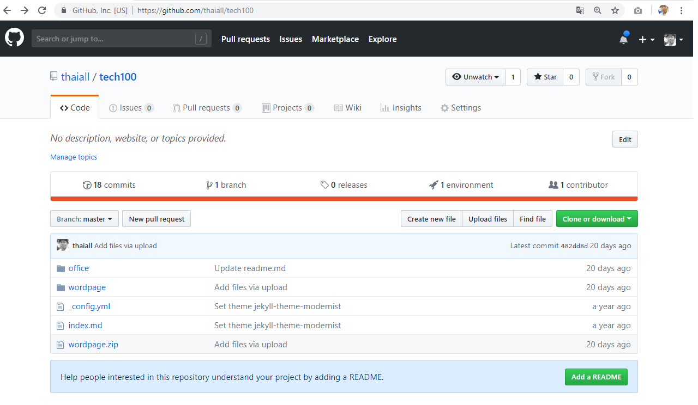

# เล่าเรื่อง github.com
## ความแตกต่างของ index.md และ readme.md 
1. ที่หน้า https://github.com/thaiall/tech100 \
เมื่อมี readme.md ก็จะไม่แสดงผลตาม index.md อัตโนมัติ  
2. ที่หน้า https://thaiall.github.io/tech100/  \
เคยสร้าง Github Pages ไว้  \
ด้วยการเข้าผ่าน Settings และเลือก theme: jekyll-theme-modernist \
จะสร้างแฟ้ม _config.yml และ index.md   
3. พบข้อความในท้ายสุดของ Repository  \
Help people interested in this repository understand your project by adding a README.  \
[Add a README] \
ถ้าไม่กดปุ่ม ก็สามารถสร้างเองได้   \
ด้วยการกดปุ่ม Create new file แล้วพิมพ์ readme.md ในช่อง [Name your file...] \
แล้วกดปุ่ม Commit new file สีเขียวด้านล่าง
4. ใน readme.md ถ้าต้องการปัดบรรทัด   
ให้พิมพ์ \ หรือใช้ &lt;br/>   
5. แนะนำเว็บ
- http://www.thaiall.com/web2/github.htm
- http://www.thaiall.com/webmaster/intro.htm
- http://www.thaiall.com/mit
- http://www.thaiall.com/office/wordpage/
6. การใส่ลิงค์ และภาพ   
เขียนว่า [ Link ](url ของ link)   
เขียนว่า ! [Image] (ชื่อภาพ)

